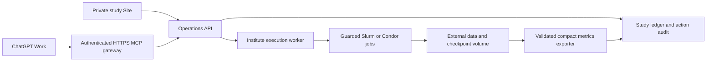

# Online study monitoring, planning and execution

Design proposal, verified against official OpenAI documentation on 2026-09-28.
This review does not deploy a service, create a Site or submit new studies.

## Recommended architecture

Keep scientific execution on the institute host with the authenticated data,
frozen environments, CVMFS and guarded Slurm/Condor workflows. Add a small
operations service there (or on an approved gateway) and expose its selected
capabilities through HTTPS MCP. ChatGPT Work becomes a client of this service.
A private Site uses the same service for a live dashboard and study controls.

The present GitHub Pages dashboard reads committed allowlisted evidence. It
does not poll the scheduler, plan experiments or launch jobs (`README.md`,
`docs/_ext/wiki_status.py`, `.github/workflows/docs.yml`). Preserve it as the
reviewed publication surface. The proposed service supplies live operational
state separately, including timestamp, staleness and failure state.

OpenAI documents remote MCP tools for live data and controlled actions on
infrastructure you operate. The server does not require a custom UI.
[MCP server guide](https://developers.openai.com/plugins/build/mcp-server)

## Minimal tool contract

These are proposed names, not tools already implemented in this repository.

| Tool | Inputs and result | Effect |
| --- | --- | --- |
| `list_studies` / `get_study` | study ID; state, timestamps, source/config hashes, comparisons and limitations | Read |
| `get_metrics` | run, scope, view, numerator/denominator and metric version | Read |
| `get_job_status` | registered run ID; scheduler status, heartbeat and bounded log tail | Read |
| `propose_study` | hypothesis, one changed factor, endpoints, cohorts, compute budget, stop/promotion rules | Save draft |
| `validate_plan` | plan version/hash; immutable inputs, disjoint UIDs, capacity, environment and resource checks | Validate/render, no submission |
| `submit_study` | validated plan hash and idempotency key, within recorded user budget/authority | Submit exact bounded jobs |
| `cancel_study` | owned run ID and reason | Cancel only the named authorized job |
| `export_review` | terminal receipts plus validated metric bundle | Create reviewable evidence update |

Use structured tool arguments and allowlisted workflows; never expose an
unrestricted shell or model-provided filesystem paths. Resolve run IDs and
artifact IDs server-side. Submission must bind the exact source, contract,
dataset/selection hashes, runtime environment and output namespace. Store the
scheduler acknowledgment before returning. On a timeout, reconcile that
acknowledgment using the idempotency key before retrying. A client reconnect
must not create duplicate jobs.

Scientific states should distinguish proposed, validated, submitted, pending,
running, failed, completed-unvalidated, evaluated and reviewed. Empty metrics
after a failure are unavailable, never zero. Persist a monotonic revision for
each plan; reject stale submission requests. Old receipts do not authorize a
new run. Existing user authorization can cover a bounded plan; the service
should ask only when a plan exceeds that recorded scope.

## Deployment sequence

1. **Build the ledger and read-only service first.** Ingest the existing
   immutable closeout/submission receipts and scheduler observations. Preserve
   evidence hashes, per-arm native failures and freshness. Expose compact
   read tools and a read-only dashboard; compare its totals to the existing
   publication for the same source revision. Do not upload event rows,
   checkpoints or multi-megabyte per-tree dumps into prompts.
2. **Connect ChatGPT Work.** Deploy the HTTPS `/mcp` endpoint. Configure user
   authentication and scoped read/plan/execute permissions. In a permitted
   account enable Developer mode, add the MCP URL in Plugins, install the
   resulting personal plugin, and invoke it from a Work chat. Test realistic
   inputs, bad IDs and requests that should not call any tool. Workspace
   administrators may control availability.
   [Official connection procedure](https://developers.openai.com/plugins/quickstart)
3. **Add planning and render-only tools.** Require a preregistered contrast,
   cohort reservation and resource ceiling. The server runs existing
   validators/renderers against the frozen source. Display predicted cost,
   eligibility counts, all acceptance gates and the exact plan digest in the
   client. Never make sealed-test access part of ordinary tuning.
4. **Add execution with a durable audit.** Provision institute service access
   using the site's supported account policy. Store secrets server-side.
   Enforce role/budget/partition limits independently of the language model.
   Test duplicate calls, scheduler timeouts, cancellation ownership, revoked
   authorization, worker restart and stale plans with a non-GPU fixture job
   before enabling a bounded real campaign.
5. **Build a private Site.** Ask Sites for an internal study monitor with
   overview, active jobs, study comparison, metric denominators, data lineage,
   next-plan review and action history. Use workspace-restricted sharing or
   explicit authenticated access. Configure the operations API server-side;
   browser bundles must not contain scheduler or storage credentials. Save a
   version for review before deploying: Sites deployment URLs are live
   production deployments. Sites can host the client; it does not supply this
   repository's institute mounts or scheduler integration automatically.
   [Sites documentation](https://learn.chatgpt.com/docs/sites)
6. **Enable event-driven monitoring.** A worker observes job transitions and
   publishes bounded metric updates. Notify on completion, failure, a broken
   scientific gate or required user action; stay quiet on unchanged pending
   jobs. Review validated terminal evidence before proposing the next study.
   A completed job does not automatically approve a successor or promotion.

For authenticated MCP, implement the documented OAuth 2.1 discovery and
resource-server validation, checking token signature, issuer, audience, expiry
and scopes on requests. Keep Site sessions and MCP identity mapped to the same
server-side permissions; displaying a button is not authorization.
[Authentication guide](https://developers.openai.com/plugins/build/auth)

Optional WebMCP Site tools can expose the same actions while a user and agent
view the same page. They depend on browser/session availability; remote MCP
works independently of an open page and is the recommended primary Work
integration. Check current account/rollout restrictions before selecting
WebMCP as a requirement.
[Site tools documentation](https://learn.chatgpt.com/docs/webmcp)

## First study-planning prompt

> Read the current scientific review and latest immutable study ledger. Check
> freshness and whether Phase62 has finished. Report deployable top-1 separately
> from oracle results and preserve every denominator and failed arm. Propose
> one experiment only after checking the open training-eligibility, metric and
> geometry findings. Hold data and compute fixed unless the hypothesis explicitly
> concerns scaling. Render and validate the plan, then execute only within the
> user's recorded authorization and resource budget. Record the plan hash and
> scheduler acknowledgment; do not chain another study automatically.

The initial implementation needs an approved service host/HTTPS domain,
identity provider, institute execution account, accessible data volume and
the intended ChatGPT workspace. Those are deployment inputs to provision,
not capabilities established by this review.
